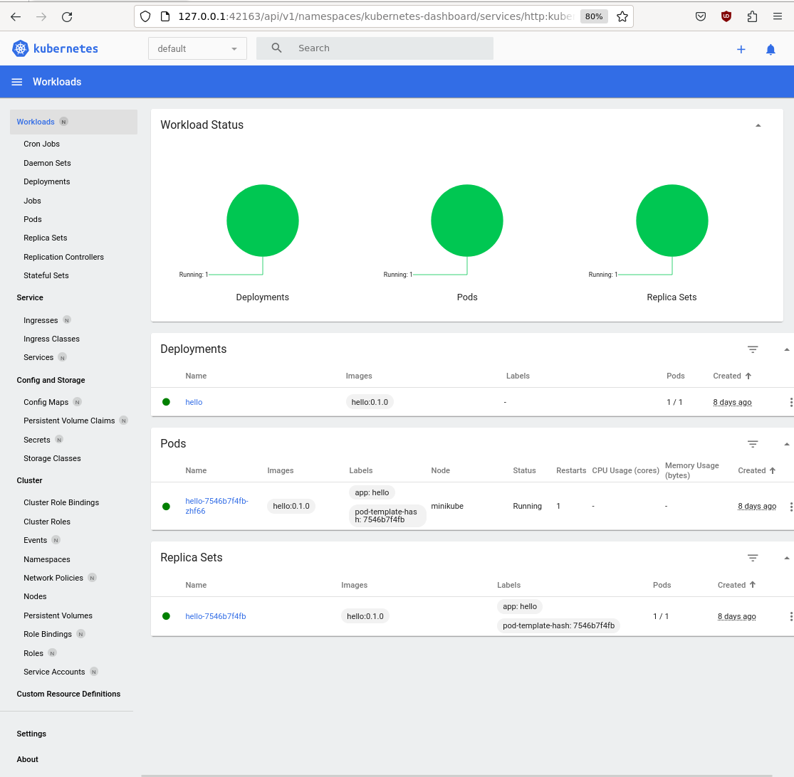
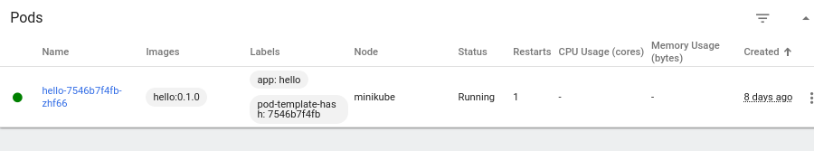
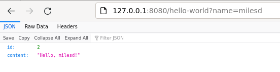

# Simple dropwizard app

How to start the Hello application
---

1. Run `mvn clean install` to build your application
1. Start application with `java -jar target/tester-1.0-SNAPSHOT.jar server config.yml`
1. To check that your application is running enter url `http://localhost:8080`

Health Check
---

To see your applications health enter url `http://localhost:8081/healthcheck`

#### Kubernetes

https://blog.devgenius.io/deploying-dropwizard-docker-image-into-minikube-cluster-59beb367685e

https://minikube.sigs.k8s.io/docs/start/?arch=%2Flinux%2Fx86-64%2Fstable%2Fbinary+download

https://linuxhandbook.com/docker-permission-denied/

Install kubectl, minikube and docker

```
$ minikube start --driver=docker
😄  minikube v1.33.1 on Ubuntu 22.04
✨  Using the docker driver based on user configuration
📌  Using Docker driver with root privileges
👍  Starting "minikube" primary control-plane node in "minikube" cluster
🚜  Pulling base image v0.0.44 ...
💾  Downloading Kubernetes v1.30.0 preload ...
    > preloaded-images-k8s-v18-v1...:  342.90 MiB / 342.90 MiB  100.00% 1.40 Mi
    > gcr.io/k8s-minikube/kicbase...:  481.58 MiB / 481.58 MiB  100.00% 1.67 Mi
🔥  Creating docker container (CPUs=2, Memory=7900MB) ...
🐳  Preparing Kubernetes v1.30.0 on Docker 26.1.1 ...
    ▪ Generating certificates and keys ...
    ▪ Booting up control plane ...
    ▪ Configuring RBAC rules ...
🔗  Configuring bridge CNI (Container Networking Interface) ...
🔎  Verifying Kubernetes components...
    ▪ Using image gcr.io/k8s-minikube/storage-provisioner:v5
🌟  Enabled addons: storage-provisioner, default-storageclass
💡  kubectl not found. If you need it, try: 'minikube kubectl -- get pods -A'
🏄  Done! kubectl is now configured to use "minikube" cluster and "default" namespace by default
```

Maven package

```
mvn package

[INFO] ------------------------------------------------------------------------
[INFO] BUILD SUCCESS
[INFO] ------------------------------------------------------------------------
[INFO] Total time:  3.283 s
[INFO] Finished at: 2024-08-01T19:47:20+01:00
[INFO] ------------------------------------------------------------------------


$ ls -ltr target/

tester-1.0-SNAPSHOT.jar
```

Build docker image

```
$ docker build -t hello:0.1.0 .
Sending build context to Docker daemon  38.02MB
Step 1/5 : FROM openjdk:21
 ---> 079114de2be1
Step 2/5 : EXPOSE 8080 8081
 ---> Using cache
 ---> 7cd7760a9e0e
Step 3/5 : COPY target/tester-1.0-SNAPSHOT.jar  tester-1.0-SNAPSHOT.jar
 ---> Using cache
 ---> 02489db8a175
Step 4/5 : COPY config.yml config.yml
 ---> Using cache
 ---> b4a98013e982
Step 5/5 : ENTRYPOINT ["java","-jar","tester-1.0-SNAPSHOT.jar","server","config.yml"]
 ---> Using cache
 ---> 46ce1e8b99b2
Successfully built 46ce1e8b99b2
Successfully tagged hello:0.1.0
```

Apply kubernetes application-config.yml

```
$ kubectl apply -f application-config.yml
configmap/application-config created
```

Apply kubernetes application-deployment.yml

```
$ kubectl apply -f application-deployment.yml
deployment.apps/hello created
service/hello created
```


minikube dashboard
```
$ minikube dashboard
🔌  Enabling dashboard ...
    ▪ Using image docker.io/kubernetesui/metrics-scraper:v1.0.8
    ▪ Using image docker.io/kubernetesui/dashboard:v2.7.0
💡  Some dashboard features require the metrics-server addon. To enable all features please run:

        minikube addons enable metrics-server

🤔  Verifying dashboard health ...
🚀  Launching proxy ...
🤔  Verifying proxy health ...


```




If you see the error 
```
Container image "hello:0.1.0" is not present with pull policy of Never
Error: ErrImageNeverPull

Run the following command:

eval $(minikube docker-env)

*Rebuild* the docker image.
```


```
$ kubectl get pods -l app=hello -o yaml |grep containerPort
- containerPort: 8080
- containerPort: 8081

$ kubectl get pods
NAME                     READY   STATUS    RESTARTS      AGE
hello-7546b7f4fb-zhf66   1/1     Running   1 (18m ago)   8d
```

The kubectl port forward command will redirect the request (to the pod):

```
$ kubectl port-forward hello-7546b7f4fb-zhf66 8080
Forwarding from 127.0.0.1:8080 -> 8080
Forwarding from [::1]:8080 -> 8080

```

Point your web browser at http://127.0.0.1:8080/hello-world?name=milesd




You will see the port redirection:
```
Handling connection for 8080
```
### Terraform

This section is optional. You can use Terraform to deploy the hello:0.1.0 docker image.

Install [Terraform](https://learn.hashicorp.com/tutorials/terraform/install-cli)

Create file named providers.tf:
```
terraform {
  required_providers {
    kubernetes = {
      source = "hashicorp/kubernetes"
      version = "2.11.0"
    }
  }
}

provider "kubernetes" {
  config_path    = "~/.kube/config"
  config_context = "minikube"
}
```

Create file name main.tf:
```
resource "kubernetes_namespace" "hello" {
  metadata {
     name = "x"
  }
}

resource "kubernetes_deployment" "hello" {
  metadata {
    name = "terraform-example"
    labels = {
      test = "MyExampleApp"
    }
     namespace = "x"
  }

  spec {
    replicas = 1

    selector {
      match_labels = {
        test = "MyExampleApp"
      }
    }

    template {
      metadata {
        labels = {
          test = "MyExampleApp"
        }
      }

      spec {
        container {
          image = "hello:0.1.0"
          name  = "example"
          port {
            container_port = 8080
          }
        }
      }
    }
  }
}
```

The important part is the image = "hello:0.1.0", and the container_port = 8080.

Run the following commands (init, plan, apply, destroy):

*terraform init*
```
$ terraform init
Initializing the backend...
Initializing provider plugins...
- Finding hashicorp/kubernetes versions matching "2.11.0"...
- Installing hashicorp/kubernetes v2.11.0...
- Installed hashicorp/kubernetes v2.11.0 (signed by HashiCorp)
Terraform has created a lock file .terraform.lock.hcl to record the provider
selections it made above. Include this file in your version control repository
so that Terraform can guarantee to make the same selections by default when
you run "terraform init" in the future.

Terraform has been successfully initialized!

You may now begin working with Terraform. Try running "terraform plan" to see
any changes that are required for your infrastructure. All Terraform commands
should now work.

If you ever set or change modules or backend configuration for Terraform,
rerun this command to reinitialize your working directory. If you forget, other
commands will detect it and remind you to do so if necessary.
$
```

*terraform plan*

```
$ terraform plan

Terraform used the selected providers to generate the following execution plan. Resource actions are indicated with the following symbols:
  + create

Terraform will perform the following actions:

  # kubernetes_deployment.hello will be created
  + resource "kubernetes_deployment" "hello" {
      + id               = (known after apply)
      + wait_for_rollout = true

      + metadata {
          + generation       = (known after apply)
          + labels           = {
              + "test" = "MyExampleApp"
            }
          + name             = "terraform-example"
          + namespace        = "x"
          + resource_version = (known after apply)
          + uid              = (known after apply)
        }

      + spec {
          + min_ready_seconds         = 0
          + paused                    = false
          + progress_deadline_seconds = 600
          + replicas                  = "1"
          + revision_history_limit    = 10

          + selector {
              + match_labels = {
                  + "test" = "MyExampleApp"
                }
            }

          + strategy (known after apply)

          + template {
              + metadata {
                  + generation       = (known after apply)
                  + labels           = {
                      + "test" = "MyExampleApp"
                    }
                  + name             = (known after apply)
                  + resource_version = (known after apply)
                  + uid              = (known after apply)
                }
              + spec {
                  + automount_service_account_token  = true
                  + dns_policy                       = "ClusterFirst"
                  + enable_service_links             = true
                  + host_ipc                         = false
                  + host_network                     = false
                  + host_pid                         = false
                  + hostname                         = (known after apply)
                  + node_name                        = (known after apply)
                  + restart_policy                   = "Always"
                  + service_account_name             = (known after apply)
                  + share_process_namespace          = false
                  + termination_grace_period_seconds = 30

                  + container {
                      + image                      = "hello:0.1.0"
                      + image_pull_policy          = (known after apply)
                      + name                       = "example"
                      + stdin                      = false
                      + stdin_once                 = false
                      + termination_message_path   = "/dev/termination-log"
                      + termination_message_policy = (known after apply)
                      + tty                        = false

                      + port {
                          + container_port = 8080
                          + protocol       = "TCP"
                        }

                      + resources (known after apply)
                    }

                  + image_pull_secrets (known after apply)

                  + readiness_gate (known after apply)

                  + volume (known after apply)
                }
            }
        }
    }

  # kubernetes_namespace.hello will be created
  + resource "kubernetes_namespace" "hello" {
      + id = (known after apply)

      + metadata {
          + generation       = (known after apply)
          + name             = "x"
          + resource_version = (known after apply)
          + uid              = (known after apply)
        }
    }

Plan: 2 to add, 0 to change, 0 to destroy.

──────────────────────────────────────────────────────────────────────────────────────────────────────────────────────────────────────────────────────────────────────────────────────────────────────────────────────────────────────────────────────────────────────────────────────────────────────────

Note: You didn't use the -out option to save this plan, so Terraform can't guarantee to take exactly these actions if you run "terraform apply" now.
$
```

*terraform apply*

```
$ terraform apply

Terraform used the selected providers to generate the following execution plan. Resource actions are indicated with the following symbols:
  + create

Terraform will perform the following actions:

  # kubernetes_deployment.hello will be created
  + resource "kubernetes_deployment" "hello" {
      + id               = (known after apply)
      + wait_for_rollout = true

      + metadata {
          + generation       = (known after apply)
          + labels           = {
              + "test" = "MyExampleApp"
            }
          + name             = "terraform-example"
          + namespace        = "x"
          + resource_version = (known after apply)
          + uid              = (known after apply)
        }

      + spec {
          + min_ready_seconds         = 0
          + paused                    = false
          + progress_deadline_seconds = 600
          + replicas                  = "1"
          + revision_history_limit    = 10

          + selector {
              + match_labels = {
                  + "test" = "MyExampleApp"
                }
            }

          + strategy (known after apply)

          + template {
              + metadata {
                  + generation       = (known after apply)
                  + labels           = {
                      + "test" = "MyExampleApp"
                    }
                  + name             = (known after apply)
                  + resource_version = (known after apply)
                  + uid              = (known after apply)
                }
              + spec {
                  + automount_service_account_token  = true
                  + dns_policy                       = "ClusterFirst"
                  + enable_service_links             = true
                  + host_ipc                         = false
                  + host_network                     = false
                  + host_pid                         = false
                  + hostname                         = (known after apply)
                  + node_name                        = (known after apply)
                  + restart_policy                   = "Always"
                  + service_account_name             = (known after apply)
                  + share_process_namespace          = false
                  + termination_grace_period_seconds = 30

                  + container {
                      + image                      = "hello:0.1.0"
                      + image_pull_policy          = (known after apply)
                      + name                       = "example"
                      + stdin                      = false
                      + stdin_once                 = false
                      + termination_message_path   = "/dev/termination-log"
                      + termination_message_policy = (known after apply)
                      + tty                        = false

                      + port {
                          + container_port = 8080
                          + protocol       = "TCP"
                        }

                      + resources (known after apply)
                    }

                  + image_pull_secrets (known after apply)

                  + readiness_gate (known after apply)

                  + volume (known after apply)
                }
            }
        }
    }

  # kubernetes_namespace.hello will be created
  + resource "kubernetes_namespace" "hello" {
      + id = (known after apply)

      + metadata {
          + generation       = (known after apply)
          + name             = "x"
          + resource_version = (known after apply)
          + uid              = (known after apply)
        }
    }

Plan: 2 to add, 0 to change, 0 to destroy.

Do you want to perform these actions?
  Terraform will perform the actions described above.
  Only 'yes' will be accepted to approve.

  Enter a value: yes

kubernetes_namespace.hello: Creating...
kubernetes_deployment.hello: Creating...
kubernetes_namespace.hello: Creation complete after 0s [id=x]
kubernetes_deployment.hello: Creation complete after 2s [id=x/terraform-example]

Apply complete! Resources: 2 added, 0 changed, 0 destroyed.
$
```

Use the kubectl command to check the deployment and pods:
```
$ kubectl get deployments -n x
NAME                READY   UP-TO-DATE   AVAILABLE   AGE
terraform-example   1/1     1            1           63s
$

$ kubectl get pods -n x
NAME                                 READY   STATUS    RESTARTS   AGE
terraform-example-7fb55bccdd-nwt6k   1/1     Running   0          97s
$

$kubectl get pods -n x -o yaml |grep containerPort
      - containerPort: 8080
$
```

The kubectl port forward command will redirect the request (to the pod):
```
$ kubectl port-forward -n x terraform-example-7fb55bccdd-nwt6k 8080
Forwarding from 127.0.0.1:8080 -> 8080
Forwarding from [::1]:8080 -> 8080
Handling connection for 8080
Handling connection for 8080
```

Use the curl command to go to http://127.0.0.1:8080/hello-world?name=alice
```
$ curl http://127.0.0.1:8080/hello-world?name=alice
{"id":2,"content":"Hello, alice!"}
$
```

*terraform destroy*

```
$ terraform destroy
kubernetes_namespace.hello: Refreshing state... [id=x]
kubernetes_deployment.hello: Refreshing state... [id=x/terraform-example]

Terraform used the selected providers to generate the following execution plan. Resource actions are indicated with the following symbols:
  - destroy

Terraform will perform the following actions:

  # kubernetes_deployment.hello will be destroyed
  - resource "kubernetes_deployment" "hello" {
      - id               = "x/terraform-example" -> null
      - wait_for_rollout = true -> null

      - metadata {
          - annotations      = {} -> null
          - generation       = 1 -> null
          - labels           = {
              - "test" = "MyExampleApp"
            } -> null
          - name             = "terraform-example" -> null
          - namespace        = "x" -> null
          - resource_version = "10005" -> null
          - uid              = "9441f854-4935-451a-bb96-be6d59df2ce4" -> null
            # (1 unchanged attribute hidden)
        }

      - spec {
          - min_ready_seconds         = 0 -> null
          - paused                    = false -> null
          - progress_deadline_seconds = 600 -> null
          - replicas                  = "1" -> null
          - revision_history_limit    = 10 -> null

          - selector {
              - match_labels = {
                  - "test" = "MyExampleApp"
                } -> null
            }

          - strategy {
              - type = "RollingUpdate" -> null

              - rolling_update {
                  - max_surge       = "25%" -> null
                  - max_unavailable = "25%" -> null
                }
            }

          - template {
              - metadata {
                  - annotations      = {} -> null
                  - generation       = 0 -> null
                  - labels           = {
                      - "test" = "MyExampleApp"
                    } -> null
                    name             = null
                    # (4 unchanged attributes hidden)
                }
              - spec {
                  - active_deadline_seconds          = 0 -> null
                  - automount_service_account_token  = true -> null
                  - dns_policy                       = "ClusterFirst" -> null
                  - enable_service_links             = true -> null
                  - host_ipc                         = false -> null
                  - host_network                     = false -> null
                  - host_pid                         = false -> null
                  - node_selector                    = {} -> null
                  - restart_policy                   = "Always" -> null
                  - share_process_namespace          = false -> null
                  - termination_grace_period_seconds = 30 -> null
                    # (5 unchanged attributes hidden)

                  - container {
                      - args                       = [] -> null
                      - command                    = [] -> null
                      - image                      = "hello:0.1.0" -> null
                      - image_pull_policy          = "IfNotPresent" -> null
                      - name                       = "example" -> null
                      - stdin                      = false -> null
                      - stdin_once                 = false -> null
                      - termination_message_path   = "/dev/termination-log" -> null
                      - termination_message_policy = "File" -> null
                      - tty                        = false -> null
                        # (1 unchanged attribute hidden)

                      - port {
                          - container_port = 8080 -> null
                          - host_port      = 0 -> null
                            name           = null
                          - protocol       = "TCP" -> null
                            # (1 unchanged attribute hidden)
                        }

                      - resources {}
                    }
                }
            }
        }
    }

  # kubernetes_namespace.hello will be destroyed
  - resource "kubernetes_namespace" "hello" {
      - id = "x" -> null

      - metadata {
          - annotations      = {} -> null
          - generation       = 0 -> null
          - labels           = {} -> null
          - name             = "x" -> null
          - resource_version = "9983" -> null
          - uid              = "7e2b974c-4c81-4e8c-8b35-1344075cc83e" -> null
            # (1 unchanged attribute hidden)
        }
    }

Plan: 0 to add, 0 to change, 2 to destroy.

Do you really want to destroy all resources?
  Terraform will destroy all your managed infrastructure, as shown above.
  There is no undo. Only 'yes' will be accepted to confirm.

  Enter a value: yes

kubernetes_namespace.hello: Destroying... [id=x]
kubernetes_deployment.hello: Destroying... [id=x/terraform-example]
kubernetes_deployment.hello: Destruction complete after 0s
kubernetes_namespace.hello: Destruction complete after 6s

Destroy complete! Resources: 2 destroyed.
$
```

*The port forward will stop:*
```
E0813 13:22:00.190729   58487 portforward.go:413] an error occurred forwarding 8080 -> 8080: error forwarding port 8080 to pod 915cbd57ef726b33b7f929a650602d0dfe627b7de455738bf8d786b777619103, uid : Error response from daemon: No such container: 915cbd57ef726b33b7f929a650602d0dfe627b7de455738bf8d786b777619103
error: lost connection to pod
```

*The curl command will no longer work:*
```
$ curl http://127.0.0.1:8080/hello-world?name=alice
curl: (52) Empty reply from server
```


